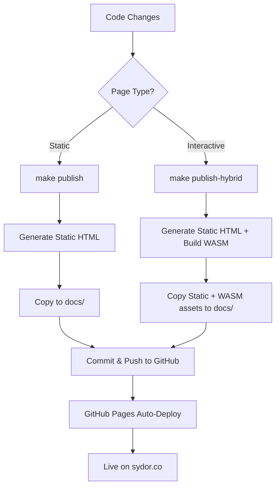

# Dioxus Hybrid Blueprint: Static Site Generation + WASM Interactivity

This blueprint shows how to create a hybrid Dioxus application that combines:
- **Static Site Generation (SSG)** for fast, SEO-friendly pages
- **WASM-powered interactivity** for specific pages that need dynamic functionality

## 🎯 Overview

Our hybrid approach generates:
1. **Static HTML pages** for most routes (home, about, blog posts)
2. **WASM-enhanced pages** for interactive functionality (contact form)
3. **GitHub Pages deployment** with custom domain support

## 🏗️ Architecture

```
┌─────────────────────────────────────────────────────────────┐
│                    Hybrid Architecture                       │
├─────────────────────────────────────────────────────────────┤
│                                                             │
│  Static Pages (SSG)           Interactive Pages (WASM)      │
│  ┌─────────────────┐          ┌─────────────────────────┐    │
│  │ • Home          │          │ • Contact Form          │    │
│  │ • About         │    +     │ • Real-time validation  │    │
│  │ • Blog Posts    │          │ • Dynamic interactions  │    │
│  │ • SEO Optimized │          │ • Dioxus Components     │    │
│  └─────────────────┘          └─────────────────────────┘    │
│                                                             │
│                    ↓ Deploy to ↓                           │
│                                                             │
│              GitHub Pages (docs/)                          │
│              Custom Domain: sydor.co                       │
└─────────────────────────────────────────────────────────────┘
```

## 🚀 Quick Start

### Build and Deploy Commands

```bash
# Generate static pages only (fast, no WASM)
make build

# Generate hybrid site (static + WASM contact page)
make build-hybrid

# Deploy static site to GitHub Pages
make deploy

# Deploy hybrid site to GitHub Pages
make deploy-hybrid

# Build, deploy and push to GitHub automatically
make publish-hybrid
```

### Development Workflow

```bash
# 1. Develop your components normally
dx serve

# 2. Test hybrid build locally
make build-hybrid
cd static_output && python -m http.server 8080

# 3. Deploy when ready
make publish-hybrid
```

## 📁 File Structure

```
dioxus_site/
├── src/
│   ├── main.rs                    # Main app + WASM entry points
│   ├── lib.rs                     # Shared components and routes
│   ├── generate_static.rs         # SSG generator
│   ├── generate_hybrid_contact.rs # Hybrid contact page generator
│   └── views/
│       ├── contact.rs             # Interactive contact component
│       ├── home.rs                # Static home page
│       └── about.rs               # Static about page
├── docs/                          # GitHub Pages deployment folder
│   ├── index.html                 # Static home page
│   ├── about/index.html           # Static about page
│   ├── contact/index.html         # Hybrid page with WASM loader
│   └── assets/
│       ├── dioxus_site-*.js       # WASM JavaScript glue
│       └── dioxus_site_bg-*.wasm  # Compiled WASM binaries
└── static_output/                 # Build output (copied to docs/)
```

## 🔧 Implementation Details

### 1. WASM Integration (main.rs)

```rust
use dioxus::prelude::*;
use wasm_bindgen::prelude::*;
use web_sys::{console, window};

// Standalone Contact component for WASM mounting
#[component]
fn ContactApp() -> Element {
    rsx! {
        div {
            class: "contact-form-container",
            Contact {}  // Your interactive Dioxus component
        }
    }
}

// Export function to mount Contact component to specific DOM element
#[wasm_bindgen]
pub fn mount_contact_component() {
    console_error_panic_hook::set_once();
    
    let window = window().expect("should have a window");
    let document = window.document().expect("should have a document");
    
    if let Some(placeholder) = document.get_element_by_id("contact-form-placeholder") {
        placeholder.set_inner_html(r#"<div id="dioxus-contact-root"></div>"#);
        
        if let Some(_root_element) = document.get_element_by_id("dioxus-contact-root") {
            let config = dioxus_web::Config::new().rootname("dioxus-contact-root");
            dioxus_web::launch::launch_cfg(ContactApp, config);
        }
    }
}

#[wasm_bindgen(start)]
pub fn wasm_main() {
    console_error_panic_hook::set_once();
    console::log_1(&"🦀 Dioxus WASM module initialized".into());
}
```

### 2. Hybrid Page Generator (generate_static.rs)

```rust
// Generate hybrid contact page that loads WASM
pub fn generate_hybrid_contact_page(
    output_dir: &Path,
    wasm_assets_dir: &Path,
) -> Result<(), Box<dyn std::error::Error>> {
    // Find WASM and JS files
    let mut js_file = None;
    for entry in std::fs::read_dir(wasm_assets_dir)? {
        let file_name = entry?.file_name().to_string_lossy().to_string();
        if file_name.contains("dioxus_site") && file_name.ends_with(".js") {
            js_file = Some(format!("/assets/{}", file_name));
            break;
        }
    }
    
    let js_path = js_file.ok_or("JS file not found")?;
    
    // Generate HTML with WASM loader script
    let content = format!(r#"
        <div id="contact-form-placeholder">
            <p>Loading interactive Dioxus form...</p>
        </div>
        
        <script type="module">
            import init, {{ mount_contact_component, wasm_main }} from '{js_path}';
            
            async function loadWasmContactForm() {{
                try {{
                    await init();
                    wasm_main();
                    await new Promise(resolve => setTimeout(resolve, 100));
                    mount_contact_component();
                    console.log('✅ Dioxus Contact component mounted');
                }} catch (error) {{
                    console.error('❌ WASM loading failed:', error);
                    // Show fallback content
                }}
            }}
            
            if (document.readyState === 'loading') {{
                document.addEventListener('DOMContentLoaded', loadWasmContactForm);
            }} else {{
                loadWasmContactForm();
            }}
        </script>
    "#);
    
    // Save to output directory
    let html_doc = create_html_document_with_css(
        "Contact - Dioxus Site",
        "Interactive contact form powered by WASM",
        &content,
        Some(&js_path),
        None,
    );
    
    let contact_dir = output_dir.join("contact");
    std::fs::create_dir_all(&contact_dir)?;
    std::fs::write(contact_dir.join("index.html"), html_doc)?;
    
    Ok(())
}
```

### 3. Makefile Build System

```makefile
# Build hybrid site (static + interactive Contact page with WASM)
build-hybrid:
	@echo "🧹 Cleaning static output..."
	rm -rf static_output
	@echo "🏗️  Generating static site (except contact)..."
	cargo run --bin generate_static --features ssr -- --skip-contact
	@echo "🔧 Building interactive Contact page with WASM..."
	dx build --release --features web
	@echo "📦 Adding WASM assets to static output..."
	mkdir -p static_output/assets
	cp -r target/dx/dioxus_site/release/web/public/assets/* static_output/assets/
	@echo "🏗️  Generating hybrid Contact page with WASM..."
	cargo run --bin generate_hybrid_contact --features ssr
	@echo "✅ Hybrid build complete! Static pages + Interactive Contact with WASM"

# Deploy hybrid build with WASM-enabled contact page
deploy-hybrid: build-hybrid
	@echo "🧹 Cleaning docs folder..."
	rm -rf docs && mkdir -p docs
	@echo "📦 Copying hybrid static files to docs..."
	cp -r static_output/* docs/
	cp assets/robots.txt docs/ && cp CNAME docs/
	@echo "✅ Hybrid deployment preparation complete!"

# Build hybrid, deploy, and push to GitHub
publish-hybrid: deploy-hybrid
	@echo "🚀 Committing and pushing hybrid site to GitHub..."
	git add docs/
	git commit -m "deploy hybrid site (static + WASM contact) $(shell date '+%Y-%m-%d %H:%M:%S')"
	git push origin main
	@echo "✅ Hybrid site published to GitHub!"
```

## 📋 Adding New Pages

### Static Page (Fast, SEO-friendly)

1. **Create component** in `src/views/`:
```rust
#[component]
pub fn Portfolio() -> Element {
    rsx! {
        div {
            h1 { "My Portfolio" }
            // Static content
        }
    }
}
```

2. **Add route** in `src/lib.rs`:
```rust
#[derive(Routable, Clone, PartialEq)]
pub enum Route {
    #[layout(Navbar)]
        #[route("/")]
        Home {},
        #[route("/portfolio")]  // <- Add this
        Portfolio {},
}
```

3. **Add generator** in `src/generate_static.rs`:
```rust
fn generate_portfolio_page(output_dir: &Path) -> Result<(), Box<dyn std::error::Error>> {
    println!("🔨 Generating: /portfolio");
    
    let content = r#"
        <h1>My Portfolio</h1>
        <p>Static portfolio content...</p>
    "#;
    
    let html_doc = create_html_document(
        "Portfolio - Dioxus Site",
        "My professional portfolio",
        content,
        None,
    );
    
    let portfolio_dir = output_dir.join("portfolio");
    std::fs::create_dir_all(&portfolio_dir)?;
    std::fs::write(portfolio_dir.join("index.html"), html_doc)?;
    
    Ok(())
}
```

4. **Call generator** in main function:
```rust
async fn main() -> Result<(), Box<dyn std::error::Error>> {
    // ... existing code ...
    generate_portfolio_page(&output_dir)?;  // <- Add this
    // ... rest of code ...
}
```

### Interactive Page (WASM-powered)

1. **Create interactive component** following the Contact component pattern
2. **Add WASM entry point** in `main.rs`
3. **Create hybrid generator** similar to `generate_hybrid_contact.rs`
4. **Update Makefile** to build the new interactive page

## 🧪 Local Testing

### Test Static Generation
```bash
make build
cd static_output
python -m http.server 8080
# Visit http://localhost:8080
```

### Test WASM Integration
```bash
make build-hybrid
cd static_output
python -m http.server 8080
# Visit http://localhost:8080/contact to test WASM loading
```

### Debug WASM Loading
Open browser console on contact page to see:
- `🚀 Loading WASM Contact Form...`
- `✅ WASM module loaded successfully`  
- `🦀 Dioxus WASM module initialized`
- `✅ Dioxus Contact component mounted`

## 🎨 Styling Integration

The hybrid approach includes comprehensive CSS:
- **Base styles** for consistent theming
- **Component-specific styles** for interactive elements  
- **Responsive design** for mobile compatibility
- **Loading animations** for WASM initialization

## 🚀 Deployment Flow



## 🔍 Troubleshooting

### WASM Not Loading
- Check browser console for JavaScript errors
- Verify WASM files exist in `docs/assets/`
- Ensure correct file paths in import statements

### Contact Form Not Interactive
- Confirm `mount_contact_component` function exists in WASM
- Check that placeholder element exists in HTML
- Verify Dioxus web config is correct

### Build Failures  
- Run `dx build --release --features web` separately
- Check Cargo.toml dependencies are correct
- Ensure dioxus-web is marked as optional dependency

## 📊 Performance Benefits

- **Static pages**: ~100ms load time, perfect SEO
- **Hybrid pages**: Static foundation + progressive WASM enhancement
- **Selective interactivity**: Only load WASM where needed
- **Asset optimization**: Automatic asset hashing and minification

## 🎯 Production Checklist

- [ ] Test all static pages load correctly
- [ ] Verify WASM components mount successfully  
- [ ] Check mobile responsiveness
- [ ] Validate SEO meta tags
- [ ] Confirm custom domain (CNAME) works
- [ ] Test 404 handling for direct navigation
- [ ] Verify robots.txt accessibility

This blueprint provides a complete foundation for building and deploying hybrid Dioxus applications that combine the best of static generation with selective WASM interactivity.
